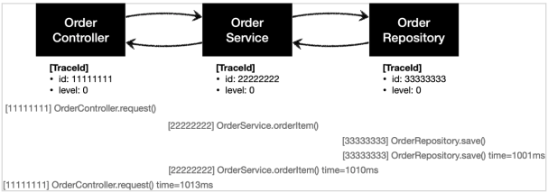

# 예제 만들기

## 프로젝트 생성

### Spring initializer

* https://start.spring.io/
* 프로젝트 선택
    * Project: Gradle - Groovy
    * Language: Java 17
    * Spring Boot: 3.0.3
* Project Metadata
    * Group: hello
    * Artifact: spring-core-advanced-1
    * Packaging: Jar
* Dependencies
    * Spring Web, Lombok

## 예제 프로젝트 만들기 - V0

### 예제

#### OrderRepository V0

```java
@Slf4j
@Repository
@RequiredArgsConstructor
public class OrderRepositoryV0 {

    public void save(String itemId) {
        if (itemId.equals("ex")) {
            throw new IllegalStateException("예외 발생!");
        }
        this.sleep(1000);
    }

    private void sleep(int millis) {
        try {
            Thread.sleep(millis);
        } catch (InterruptedException e) {
            log.info("Thread Sleep Interrupted", e);
        }
    }
}
```

* `@Repository`
    * 컴포넌트 스캔의 대상이 된다. 따라서 스프링 빈으로 자동 등록된다.
* `sleep(1000)`
    * 리포지토리는 상품을 저장하는데 약 1초 정도 걸리는 것으로 가정하기 위해 1초 지연을 주었다. (1000ms)
* 예외가 발생하는 상황도 확인하기 위해 파라미터 `itemId`의 값이 `ex`로 넘어오면 `IllegalStateException` 예외가 발생하도록 했다.

#### OrderService V0

```java
@Service
@RequiredArgsConstructor
public class OrderServiceV0 {
    private final OrderRepositoryV0 orderRepository;

    public void orderItem(String itemId) {
        orderRepository.save(itemId);
    }
}
```

* `@Service`
    * 컴포넌트 스캔의 대상이 된다.

#### OrderController V0

```java
@RestController
@RequestMapping("/v0")
@RequiredArgsConstructor
public class OrderControllerV0 {
    private final OrderServiceV0 orderService;

    @GetMapping("/request")
    public String request(
            @RequestParam String itemId
    ) {
        orderService.orderItem(itemId);
        return itemId;
    }
}
```

* `@RestController`
    * 컴포넌트 스캔과 스프링 Rest 컨트롤러로 인식된다.

## 로그 추적기 - 요구사항 분석

### 요구사항

여러분이 새로운 회사에 입사했는데, 수 년간 운영중인 거대한 프로젝트에 투입되었다.
전체 소스 코드는 수 십만 라인이고, 클래스 수도 수 백개 이상이다.
여러분에게 처음 맡겨진 요구사항은 로그 추적기를 만드는 것이다.

애플리케이션이 커지면서 점점 모니터링과 운영이 중요해지는 단계이다.
특히 최근 자주 병목이 발생하고 있다.
어떤 부분에서 병목이 발생하는지, 그리고 어떤 부분에서 예외가 발생하는지를 로그를 통해 확인하는 것이 점점 중요해지고 있다.

기존에는 개발자가 문제가 발생한 다음에 관련 부분을 어렵게 찾아서 로그를 하나하나 직접 만들어서 남겼다.
로그를 미리 남겨둔다면 이런 부분을 손쉽게 찾을 수 있을 것이다.
이 부분을 개선하고 자동화 하는 것이 여러분의 미션이다.

#### 요구사항 정리

* 모든 PUBLIC 메서드의 호출과 응답 정보를 로그로 출력
* 애플리케이션의 흐름을 변경하면 안됨
    * 로그를 남긴다고 해서 비즈니스 로직의 동작에 영향을 주면 안됨
* 메서드 호출에 걸린 시간
* 정상 흐름과 예외 흐름 구분
    * 예외 발생시 예외 정보가 남아야 함
* 메서드 호출의 깊이 표현
* HTTP 요청을 구분
    * HTTP 요청 단위로 특정 ID를 남겨서 어떤 HTTP 요청에서 시작된 것인지 명확하게 구분이 가능해야 함
    * 트랜잭션 ID (DB 트랜잭션 X), 여기서는 하나의 HTTP 요청이 시작해서 끝날 때 까지를 하나의 트랜잭션이라 함

#### 예시

```
정상 요청
[796bccd9] OrderController.request()
[796bccd9] |-->OrderService.orderItem()
[796bccd9] | |-->OrderRepository.save()
[796bccd9] | |<--OrderRepository.save() time=1004ms
[796bccd9] |<--OrderService.orderItem() time=1014ms
[796bccd9] OrderController.request() time=1016ms

예외 발생
[b7119f27] OrderController.request()
[b7119f27] |-->OrderService.orderItem()
[b7119f27] | |-->OrderRepository.save()
[b7119f27] | |<X-OrderRepository.save() time=0ms ex=java.lang.IllegalStateException: 예외 발생!
[b7119f27] |<X-OrderService.orderItem() time=10ms ex=java.lang.IllegalStateException: 예외 발생!
[b7119f27] OrderController.request() time=11ms ex=java.lang.IllegalStateException: 예외 발생!
```

## 로그 추적기 V1 - 프로토타입 개발

### 프로토타입 개발

애플리케이션의 모든 로직에 직접 로그를 남겨도 되지만, 그것보다는 더 효율적인 개발 방법이 필요하다.
특히 트랜잭션ID와 깊이를 표현하는 방법은 기존 정보를 이어 받아야 하기 때문에 단순히 로그만 남긴다고 해결할 수 있는 것은 아니다.

요구사항에 맞추어 애플리케이션에 효과적으로 로그를 남기기 위한 로그 추적기를 개발해보자.
먼저 프로토타입 버전을 개발해보자. 아마 코드를 모두 작성하고 테스트 코드까지 실행해보아야 어떤 것을 하는지 감이 올 것이다.

### 예제

#### TraceId

```java
/**
 * 로그 추적기의 트랜잭션 ID와 깊이 표현
 */
@Getter
public class TraceId {
    /**
     * 현재 Trace의 UUID
     */
    private final String id;

    /**
     * 현재 Trace의 깊이
     */
    private final int level;

    /**
     * 새로운 Trace 생성
     */
    public TraceId() {
        this.id = this.createId();
        this.level = 0;
    }

    /**
     * 내부 호출용 생성자
     */
    private TraceId(String ID, int LEVEL) {
        this.id = ID;
        this.level = LEVEL;
    }

    /**
     * 새로운 UUID 생성
     */
    private String createId() {
        return UUID.randomUUID().toString().substring(0, 8);
    }

    /**
     * @return 다음 LEVEL Trace
     */
    public TraceId createNextId() {
        return new TraceId(id, level + 1);
    }

    /**
     * @return 이전 LEVEL Trace
     */
    public TraceId createPreviousId() {
        return new TraceId(id, level - 1);
    }

    /**
     * @return LEVEL == 0
     */
    public boolean isFirstLevel() {
        return level == 0;
    }
}
```

#### TraceStatus

```java
/**
 * 로그 상태 정보
 */
@Getter
public class TraceStatus {
    /**
     * 최초 Trace
     */
    private final TraceId traceId;

    /**
     * 시작 시간
     */
    private final Long startTimeMs;

    /**
     * 최근 로그 메시지
     */
    private final String message;

    /**
     * @param traceId     최초 Trace
     * @param startTimeMs 시작 시간
     * @param message     로그 메시지
     */
    public TraceStatus(TraceId traceId, Long startTimeMs, String message) {
        this.traceId = traceId;
        this.startTimeMs = startTimeMs;
        this.message = message;
    }
}
```

#### HelloTrace V1

```java
@Slf4j
@Component
public class HelloTraceV1 {
    private static final String START_PREFIX = "-->";
    private static final String COMPLETE_PREFIX = "<--";
    private static final String EX_PREFIX = "<X-";

    /**
     * Trace Level 에 따라 공간을 확보하는 메서드
     * <p>- LEVEL 0: </p>
     * <p>- LEVEL 1: |--></p>
     * <p>- LEVEL 2: |   |--></p>
     *
     * @param prefix 적용할 접두사
     * @param level  현재 Trace Level
     */
    private static String addSpace(String prefix, int level) {
        StringBuilder sb = new StringBuilder();
        for (int i = 0; i < level; i++) {
            sb.append((i == level - 1) ? "|" + prefix : "|   ");
        }
        return sb.toString();
    }

    /**
     * 새로운 Trace 시작
     *
     * @param message 로그 메시지
     * @return {@link TraceStatus}
     */
    public TraceStatus begin(String message) {
        TraceId traceId = new TraceId();
        Long startTimeMs = System.currentTimeMillis();
        log.info("[{}] {}{}", traceId.getId(), addSpace(START_PREFIX, traceId.getLevel()), message);

        return new TraceStatus(traceId, startTimeMs, message);
    }

    /**
     * 현재 Trace 종료
     * - 일반 종료
     *
     * @param status {@link TraceStatus}
     */
    public void end(TraceStatus status) {
        complete(status, null);
    }

    /**
     * 현재 Trace 종료
     * - 예외 발생
     *
     * @param status {@link TraceStatus}
     * @param e      발생한 예외
     */
    public void exception(TraceStatus status, Exception e) {
        complete(status, e);
    }

    /**
     * 현재 Trace가 종료됨에 따라 로그를 출력하기 위함
     *
     * @param status {@link TraceStatus}
     * @param e      발생한 예외
     */
    private void complete(TraceStatus status, Exception e) {
        Long stopTimeMs = System.currentTimeMillis();
        long resultTimeMs = stopTimeMs - status.getStartTimeMs();
        TraceId traceId = status.getTraceId();

        if (e == null) {
            log.info("[{}] {}{} time = {}ms",
                    traceId.getId(),
                    addSpace(COMPLETE_PREFIX, traceId.getLevel()),
                    status.getMessage(), resultTimeMs
            );
        } else {
            log.info("[{}] {}{} time = {}ms ex = {}",
                    traceId.getId(),
                    addSpace(EX_PREFIX, traceId.getLevel()),
                    status.getMessage(), resultTimeMs, e.getMessage()
            );
        }
    }
}
```

#### HelloTrace V1 Test

```java
/**
 * {@link HelloTraceV1} Test
 */
class HelloTraceV1Test {
    @Test
    void begin_end() {
        HelloTraceV1 trace = new HelloTraceV1();
        TraceStatus status = trace.begin("hello");
        trace.end(status);
    }

    @Test
    void begin_exception() {
        HelloTraceV1 trace = new HelloTraceV1();
        TraceStatus status = trace.begin("hello");
        trace.exception(status, new IllegalStateException());
    }
}
```

## 로그 추적기 V1 - 적용

### Controller V1

#### OrderController V1

```java
@RestController
@RequestMapping("/v1")
@RequiredArgsConstructor
public class OrderControllerV1 {
    private final OrderServiceV1 orderService;
    private final HelloTraceV1 trace;

    @GetMapping("/request")
    public String request(
            @RequestParam String itemId
    ) {
        TraceStatus status = null;

        try {
            status = trace.begin("OrderController.request()");
            orderService.orderItem(itemId);
            trace.end(status);
            return itemId;
        } catch (Exception e) {
            trace.exception(status, e);
            throw e;
        }
    }
}
```

#### 결과 로그

```
# 정상 호출
[63eff67a] OrderController.request()
[63eff67a] OrderController.request() time = 1003ms

# 예외 발생
[48f06bb2] OrderController.request()
[48f06bb2] OrderController.request() time = 0ms ex = 예외 발생!
```

### Service, Repository V1

#### OrderService V1

```java
@Service
@RequiredArgsConstructor
public class OrderServiceV1 {
    private final OrderRepositoryV1 orderRepository;
    private final HelloTraceV1 trace;

    public void orderItem(String itemId) {
        TraceStatus status = null;
        try {
            status = trace.begin("OrderService.orderItem()");
            orderRepository.save(itemId);
            trace.end(status);
        } catch (Exception e) {
            trace.exception(status, e);
            throw e;
        }
    }
}
```

#### OrderRepository V1

```java
@Slf4j
@Repository
@RequiredArgsConstructor
public class OrderRepositoryV1 {

    private final HelloTraceV1 trace;

    public void save(String itemId) {
        TraceStatus status = null;
        try {
            status = trace.begin("OrderRepository.save()");

            // 저장 로직 시작
            if (itemId.equals("ex")) {
                throw new IllegalStateException("예외 발생!");
            }
            this.sleep(1000);
            // 저장 로직 종료

            trace.end(status);
        } catch (Exception e) {
            trace.exception(status, e);
            throw e;
        }

    }

    private void sleep(int millis) {
        try {
            Thread.sleep(millis);
        } catch (InterruptedException e) {
            log.info("Thread Sleep Interrupted", e);
        }
    }
}
```

#### 결과



```
# 정상 흐름
[e555c1ec] OrderController.request()
[3ef0ae15] OrderService.orderItem()
[23ba164a] OrderRepository.save()
[23ba164a] OrderRepository.save() time = 1005ms
[3ef0ae15] OrderService.orderItem() time = 1006ms
[e555c1ec] OrderController.request() time = 1007ms

# 예외 발생
[c7761f63] OrderController.request()
[8d64b8ac] OrderService.orderItem()
[16588e83] OrderRepository.save()
[16588e83] OrderRepository.save() time = 1ms ex = 예외 발생!
[8d64b8ac] OrderService.orderItem() time = 1ms ex = 예외 발생!
[c7761f63] OrderController.request() time = 1ms ex = 예외 발생!
```

### 남은 문제

아직 구현하지 못한 요구사항은 메서드 호출의 깊이를 표현하고, 같은 HTTP 요청이면 같은 트랜잭션 ID를 남기는 것이다.
이 기능은 직전 로그의 깊이와 트랜잭션 ID가 무엇인지 알아야 할 수 있는 일이다.

예를 들어서 `OrderController.request()`에서 로그를 남길 때 어떤 깊이와 어떤 트랜잭션 ID를 사용했는지를
그 다음에 로그를 남기는 `OrderService.orderItem()`에서 로그를 남길 때 알아야한다.

결국 현재 로그의 상태 정보인 트랜잭션 ID 와 level 이 다음으로 전달되어야 한다.

정리하면 로그에 대한 문맥(`Context`) 정보가 필요하다.

## 로그 추적기 V2 - 파라미터로 동기화 개발

## 로그 추적기 V2 - 적용
