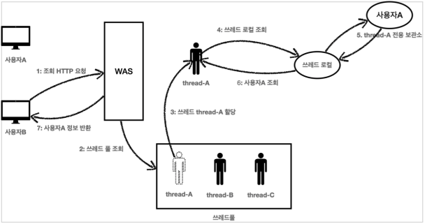

# 쓰레드 로컬 - ThreadLocal

## 필드 동기화 - 개발

### 예제

#### LogTrace

```java
/**
 * LogTrace Interface
 */
public interface LogTrace {
    /**
     * 해당 객체가 시작할때 호출
     *
     * @param message 메시지
     * @return {@link TraceStatus}
     */
    TraceStatus begin(String message);

    /**
     * 정상 종료시 호출
     *
     * @param status {@link TraceStatus}
     */
    void end(TraceStatus status);

    /**
     * 예외 발생시 호출
     *
     * @param status {@link TraceStatus}
     * @param e      발생한 예외
     */
    void exception(TraceStatus status, Exception e);
}
```

#### FieldLogTrace

```java
@Slf4j
public class FieldLogTrace implements LogTrace {
    private static final String START_PREFIX = "-->";
    private static final String COMPLETE_PREFIX = "<--";
    private static final String EX_PREFIX = "<X-";

    /**
     * traceId 동기화, 동시성 이슈 발생
     */
    private TraceId traceIdHolder;

    /**
     * Trace Level 에 따라 공간을 확보하는 메서드
     * <p>- LEVEL 0: </p>
     * <p>- LEVEL 1: |--></p>
     * <p>- LEVEL 2: |   |--></p>
     *
     * @param prefix 적용할 접두사
     * @param level  현재 Trace Level
     */
    private static String addSpace(String prefix, int level) {
        StringBuilder sb = new StringBuilder();
        for (int i = 0; i < level; i++) {
            sb.append((i == level - 1) ? "|" + prefix : "|   ");
        }
        return sb.toString();
    }

    /**
     * TraceId 동기화<br>
     * - 최초 호출: 새로운 TraceId 생성<br>
     * - 이후 호출: 다음 Level TraceId 생성
     */
    private void syncTraceId() {
        if (traceIdHolder == null) {
            traceIdHolder = new TraceId();
        } else {
            traceIdHolder = traceIdHolder.createNextId();
        }
    }

    /**
     * TraceId LEVEL 감소<br>
     * - Level 0 : null<br>
     * - Level 1~: 이전 Level TraceId 생성
     */
    private void releaseTraceId() {
        if (traceIdHolder.isFirstLevel()) {
            traceIdHolder = null;
        } else {
            traceIdHolder = traceIdHolder.createPreviousId();
        }
    }

    /**
     * 현재 Trace가 종료됨에 따라 로그를 출력하기 위함
     *
     * @param status {@link TraceStatus}
     * @param e      발생한 예외
     */
    private void complete(TraceStatus status, Exception e) {
        Long stopTimeMs = System.currentTimeMillis();
        long resultTimeMs = stopTimeMs - status.getStartTimeMs();
        TraceId traceId = status.getTraceId();

        if (e == null) {
            log.info("[{}] {}{} time = {}ms",
                    traceId.getId(),
                    addSpace(COMPLETE_PREFIX, traceId.getLevel()),
                    status.getMessage(), resultTimeMs
            );
        } else {
            log.info("[{}] {}{} time = {}ms ex = {}",
                    traceId.getId(),
                    addSpace(EX_PREFIX, traceId.getLevel()),
                    status.getMessage(), resultTimeMs, e.toString()
            );
        }

        releaseTraceId();
    }

    @Override
    public TraceStatus begin(String message) {
        syncTraceId();

        TraceId traceId = traceIdHolder;
        Long startTimeMs = System.currentTimeMillis();
        log.info("[{}] {}{}", traceId.getId(), addSpace(START_PREFIX, traceId.getLevel()), message);

        return new TraceStatus(traceId, startTimeMs, message);
    }

    @Override
    public void end(TraceStatus status) {
        complete(status, null);
    }

    @Override
    public void exception(TraceStatus status, Exception e) {
        complete(status, e);
    }
}
```

#### FieldLogTraceTest

```java
/**
 * {@link FieldLogTrace} Test
 */
class FieldLogTraceTest {

    FieldLogTrace trace = new FieldLogTrace();

    @Test
    void begin_end_level2() {
        TraceStatus status1 = trace.begin("hello");
        TraceStatus status2 = trace.begin("world");

        trace.end(status2);
        trace.end(status1);
    }

    @Test
    void begin_exception_level2() {
        TraceStatus status1 = trace.begin("hello");
        TraceStatus status2 = trace.begin("world");

        trace.exception(status2, new IllegalStateException());
        trace.exception(status1, new IllegalStateException());
    }

}
```

### 테스트 결과

```
# 정상 결과
[7d92ba2e] hello
[7d92ba2e] |-->world
[7d92ba2e] |<--world time = 0ms
[7d92ba2e] hello time = 4ms

# 예외 발생
[ce39a554] hello
[ce39a554] |-->world
[ce39a554] |<X-world time = 0ms ex = java.lang.IllegalStateException
[ce39a554] hello time = 0ms ex = java.lang.IllegalStateException
```

## 필드 동기화 - 적용

## 필드 동기화 - 동시성 문제

## ThreadLocal - 소개

## ThreadLocal - 예제 코드

## 쓰레드 로컬 동기화 - 개발

## 쓰레드 로컬 동기화 - 적용

## 쓰레드 로컬 - 주의사항



쓰레드 로컬의 값을 제거하지 않는다면, 다른 사용자가 사용했던 값을 볼 수 있는 일이 일어날 수 있다.

즉, 이전 사용자가 쓰레드 A를 사용하고 remove로 제거되지 않았다면,
쓰레드 A를 사용하는 다음 사용자는 이전 사용자의 데이터를 확인할 수 있는 것이다.