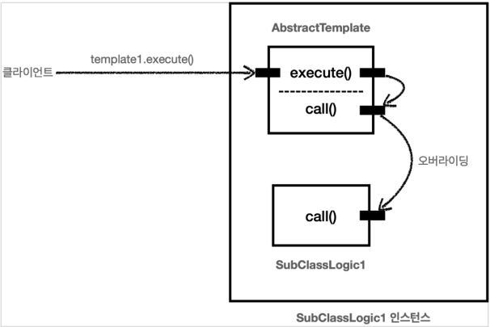
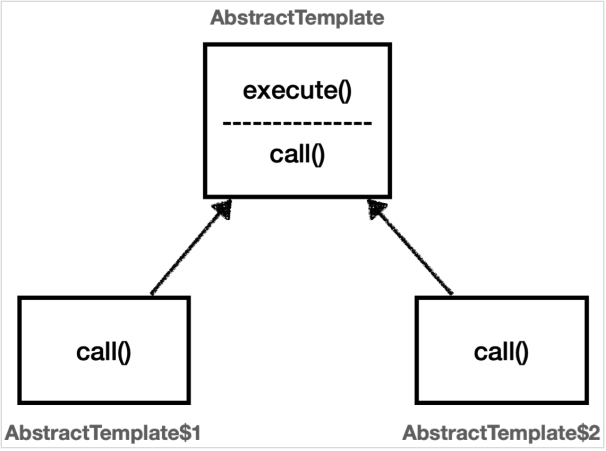
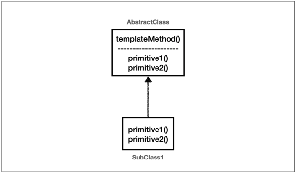
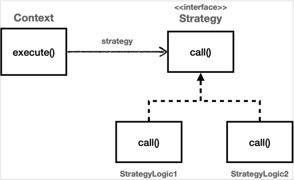
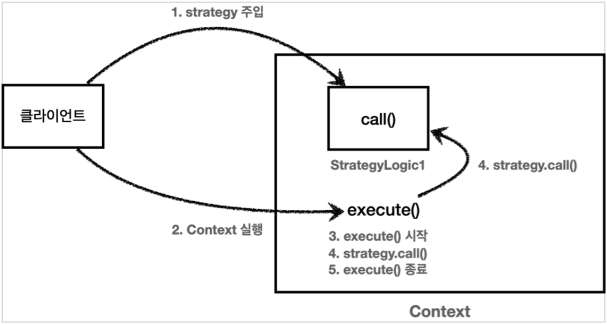

# 템플릿 메서드 패턴과 콜백 패턴

## 템플릿 메서드 패턴 - 시작

### 핵심 기능 vs 부가 기능

핵심 기능은 해당 객체가 제공하는 고유의 기능이다.
예를 들어서 orderService 의 핵심 기능은 주문 로직이다.

메서드 단위로 보면 `orderService.orderItem()`의 핵심 기능은 주문 데이터를 저장하기 위해
리포지토리를 호출하는 `orderRepository.save(itemId)` 코드가 핵심 기능이다.

부가 기능은 핵심 기능을 보조하기 위해 제공되는 기능이다.
예를 들어서 로그 추적 로직, 트랜잭션 기능이 있다.
이러한 부가 기능은 단독으로 사용되지는 않고, 핵심 기능과 함께 사용된다.
예를 들어서 로그 추적 기능은 어떤 핵심 기능이 호출되었는지 로그를 남기기 위해 사용한다.
그러니까 핵심 기능을 보조하기 위해 존재한다

### 변하는 것과 변하지 않는 것을 분리

좋은 설계는 변하는 것과 변하지 않는 것을 분리하는 것이다.
여기서 핵심 기능 부분은 변하고, 로그 추적기를 사용하는 부분은 변하지 않는 부분이다.
이 둘을 분리해서 모듈화해야 한다.

**템플릿 메서드 패턴**(Template Method Pattern)은 이런 문제를 해결하는 디자인 패턴이다.

## 템플릿 메서드 패턴 - 예제 1

### 예제

#### TemplateMethodTest

```java
@Slf4j
public class TemplateMethodTest {

    @Test
    void templateMethodV0() {
        logic1();
        logic2();
    }

    private void logic1() {
        long startTime = System.currentTimeMillis();

        log.info("비즈니스 로직 1 실행");

        long endTime = System.currentTimeMillis();
        long resultTime = endTime - startTime;
        log.info("resultTime = {}", resultTime);
    }

    private void logic2() {
        long startTime = System.currentTimeMillis();

        log.info("비즈니스 로직 2 실행");

        long endTime = System.currentTimeMillis();
        long resultTime = endTime - startTime;
        log.info("resultTime = {}", resultTime);
    }
}
```

#### 실행 결과

```
비즈니스 로직 1 실행
resultTime = 2
비즈니스 로직 2 실행
resultTime = 0
```

### 분석

* 변하는 부분: 비즈니스 로직
* 변하지 않는 부분: 시간 측정

이제 이 둘을 분리해보자.

## 템플릿 메서드 패턴 - 예제 2

### 템플릿 메서드 패턴 구조


### 예제

#### AbstractTemplate

```java
/**
 * 템플릿 메서드 패턴
 * - 추상 클래스 이용
 */
@Slf4j
public abstract class AbstractTemplate {

    /**
     * call() 메서드의 작동 시간을 구하는 메서드
     */
    public void execute() {
        long startTime = System.currentTimeMillis();

        call();

        long endTime = System.currentTimeMillis();
        long resultTime = endTime - startTime;
        log.info("resultTime = {}", resultTime);
    }

    /**
     * 비즈니스 로직 구현
     */
    protected abstract void call();
}
```

#### SubClassLogic1

```java
/**
 * 비즈니스 로직 1
 */
@Slf4j
public class SubClassLogic1 extends AbstractTemplate {
    @Override
    protected void call() {
        log.info("비즈니스 로직 1 실행");
    }
}
```

#### SubClassLogic2

```java
/**
 * 비즈니스 로직 2
 */
@Slf4j
public class SubClassLogic2 extends AbstractTemplate {
    @Override
    protected void call() {
        log.info("비즈니스 로직 2 실행");
    }
}
```

#### TemplateMethodTest

```java
@Slf4j
public class TemplateMethodTest {
    /**
     * 템플릿 메서드 패턴 적용
     */
    @Test
    void templateMethodV1() {
        AbstractTemplate template1 = new SubClassLogic1();
        template1.execute();

        AbstractTemplate template2 = new SubClassLogic1();
        template2.execute();
    }
}
```

#### 결과 로그

```
SubClassLogic1   - 비즈니스 로직 1 실행
AbstractTemplate - resultTime = 4
SubClassLogic1   - 비즈니스 로직 1 실행
AbstractTemplate - resultTime = 0
```

### 템플릿 메서드 패턴 인스턴스 호출 그림



템플릿 메서드 패턴은 이렇게 다형성을 사용해서 변하는 부분과 변하지 않는 부분을 분리하는 방법이다.

## 템플릿 메서드 패턴 - 예제 3

### 익명 내부 클래스 사용하기



### 예제

#### TemplateMethodTest

```java
/**
 * 템플릿 메서드 패턴, 익명 내부 클래스 사용
 */
@Test
void templateMethodV2() {
    AbstractTemplate template1 = new AbstractTemplate() {
        @Override
        protected void call() {
            log.info("비즈니스 로직 1 실행");
        }
    };
    log.info("클래스 이름 1 = {}", template1.getClass());
    template1.execute();

    AbstractTemplate template2 = new AbstractTemplate() {
        @Override
        protected void call() {
            log.info("비즈니스 로직 2 실행");
        }
    };
    log.info("클래스 이름 2 = {}", template2.getClass());
    template2.execute();
}
```

#### 실행 결과

```
TemplateMethodTest - 클래스 이름 1 = class hello.springcoreadvanced1.trace.template.TemplateMethodTest$1
TemplateMethodTest - 비즈니스 로직 1 실행
AbstractTemplate   - resultTime = 0

TemplateMethodTest - 클래스 이름 2 = class hello.springcoreadvanced1.trace.template.TemplateMethodTest$2
TemplateMethodTest - 비즈니스 로직 2 실행
AbstractTemplate   - resultTime = 0
```

## 템플릿 메서드 패턴 - 적용 1

### AbstractTemplate

```java
public abstract class AbstractTemplate<T> {
    private final LogTrace trace;

    public AbstractTemplate(LogTrace trace) {
        this.trace = trace;
    }

    public T execute(String message) {
        TraceStatus status = null;

        try {
            status = trace.begin(message);

            T result = this.call();

            trace.end(status);
            return result;
        } catch (Exception e) {
            trace.exception(status, e);
            throw e;
        }
    }

    protected abstract T call();
}
```

* `AbstractTemplate`은 템플릿 메서드 패턴에서 부모 클래스이고, 템플릿 역할을 한다.
* `<T>` 제네릭을 사용했다. 반환 타입을 정의한다.
* 객체를 생성할 때 내부에서 사용할 `LogTrace trace`를 전달 받는다.
* 로그에 출력할 `message`를 외부에서 파라미터로 전달받는다.
* 템플릿 코드 중간에 `call()` 메서드를 통해서 변하는 부분을 처리한다.
* `abstract T call()`은 변하는 부분을 처리하는 메서드이다. 이 부분은 상속으로 구현해야 한다.

### MVC

#### OrderController V4

```java
@RestController
@RequestMapping("/v4")
@RequiredArgsConstructor
public class OrderControllerV4 {
    private final OrderServiceV4 orderService;
    private final LogTrace trace;

    @GetMapping("/request")
    public String request(
            @RequestParam String itemId
    ) {
        AbstractTemplate<String> abstractTemplate = new AbstractTemplate<>(trace) {
            @Override
            protected String call() {
                orderService.orderItem(itemId);
                return itemId;
            }
        };

        return abstractTemplate.execute("OrderController.request()");
    }
}
```

#### OrderService V4

```java
@Service
@RequiredArgsConstructor
public class OrderServiceV4 {
    private final OrderRepositoryV4 orderRepository;
    private final LogTrace trace;

    public void orderItem(String itemId) {
        AbstractTemplate<Void> abstractTemplate = new AbstractTemplate<>(trace) {
            @Override
            protected Void call() {
                orderRepository.save(itemId);
                return null;
            }
        };

        abstractTemplate.execute("OrderService.orderItem()");
    }
}
```

#### OrderRepository V4

```java
@Slf4j
@Repository
@RequiredArgsConstructor
public class OrderRepositoryV4 {

    private final LogTrace trace;

    public void save(String itemId) {
        AbstractTemplate<Void> abstractTemplate = new AbstractTemplate<>(trace) {
            @Override
            protected Void call() {
                if (itemId.equals("ex")) {
                    throw new IllegalStateException("예외 발생!");
                }
                sleep(1000);

                return null;
            }
        };

        abstractTemplate.execute("OrderRepository.save()");
    }

    private void sleep(int millis) {
        try {
            Thread.sleep(millis);
        } catch (InterruptedException e) {
            log.info("Thread Sleep Interrupted", e);
        }
    }
}
```

### 실행 결과

* http://localhost:8080/v4/request?itemId=hello

```
h.s.trace.logtrace.ThreadLocalLogTrace   : [cb94011b] OrderController.request()
h.s.trace.logtrace.ThreadLocalLogTrace   : [cb94011b] |-->OrderService.orderItem()
h.s.trace.logtrace.ThreadLocalLogTrace   : [cb94011b] |   |-->OrderRepository.save()
h.s.trace.logtrace.ThreadLocalLogTrace   : [cb94011b] |   |<--OrderRepository.save() time = 1004ms
h.s.trace.logtrace.ThreadLocalLogTrace   : [cb94011b] |<--OrderService.orderItem() time = 1004ms
h.s.trace.logtrace.ThreadLocalLogTrace   : [cb94011b] OrderController.request() time = 1006ms
```

## 템플릿 메서드 패턴 - 적용 2

### 좋은 설계란?

좋은 설계라는 것은 무엇일까?
수 많은 멋진 정의가 있겠지만, 진정한 좋은 설계는 바로 변경이 일어날 때 자연스럽게 드러난다.

지금까지 로그를 남기는 부분을 모아서 하나로 모듈화하고, 비즈니스 로직 부분을 분리했다.
여기서 만약 로그를 남기는 로직을 변경해야 한다고 생각해보자.
단순히 `AbstractTemplate`코드만 변경하면 된다.

템플릿이 없는 V3 상태에서 로그를 남기는 로직을 변경해야 한다고 생각해보자.
이 경우 모든 클래스를 다 찾아서 고쳐야 한다. 클래스가 수백 개라면 생각만해도 끔찍하다.

### 단일 책임 원칙(SRP)

`V4`는 단순히 템플릿 메서드 패턴을 적용해서 소스코드 몇줄을 줄인 것이 전부가 아니다.
로그를 남기는 부분에 **단일 책임 원칙**(`SRP`)을 지킨 것이다.
변경 지점을 하나로 모아서 변경에 쉽게 대처할 수 있는 구조를 만든 것이다.

## 템플릿 메서드 패턴 - 정의

### GOF 디자인 패턴의 정의



> 템플릿 메서드 디자인 패턴의 목적은 다음과 같습니다.<br>
> "작업에서 알고리즘의 골격을 정의하고 일부 단계를 하위 클래스로 연기합니다.
> 템플릿 메서드를 사용하면 하위 클래스가 알고리즘의 구조를 변경하지 않고도 알고리즘의 특정 단계를 재정의할 수 있습니다." [GOF]

부모 클래스에 알고리즘의 골격인 템플릿을 정의하고, 일부 변경되는 로직은 자식 클래스에 정의하는 것이다.
이렇게 하면 자식 클래스가 알고리즘의 전체 구조를 변경하지 않고, 특정 부분만 재정의할 수 있다.
결국 상속과 오버라이딩을 통한 **다형성**으로 문제를 해결하는 것이다.

#### 하지만

템플릿 메서드 패턴은 상속을 사용한다. 따라서 상속에서 오는 단점들을 그대로 안고간다.
특히 자식 클래스가 부모 클래스와 컴파일 시점에 강하게 결합되는 문제가 있다. 이것은 **의존관계에 대한 문제**이다.
자식 클래스 입장에서는 부모 클래스의 기능을 전혀 사용하지 않는다.

이번 장에서 지금까지 작성했던 코드를 떠올려보자.
자식 클래스를 작성할 때 부모 클래스의 기능을 사용한 것이 있었던가?

그럼에도 불구하고 템플릿 메서드 패턴을 위해 자식 클래스는 부모 클래스를 상속 받고 있다.

상속을 받는 다는 것은 특정 부모 클래스를 **의존**하고 있다는 것이다.
자식 클래스의 `extends` 다음에 바로 부모 클래스가 코드상에 지정되어 있다.
따라서 부모 클래스의 기능을 사용하든 사용하지 않든 간에 부모 클래스를 강하게 의존하게 된다.

여기서 강하게 의존한다는 뜻은 자식 클래스의 코드에 부모 클래스의 코드가 명확하게 적혀 있다는 뜻이다.
UML에서 상속을 받으면 삼각형 화살표가 자식 -> 부모 를 향하고 있는 것은 이런 의존관계를 반영하는 것이다.

자식 클래스 입장에서는 부모 클래스의 기능을 전혀 사용하지 않는데, 부모 클래스를 알아야한다.
이것은 좋은 설계가 아니다. 그리고 이런 잘못된 의존관계 때문에 부모 클래스를 수정하면, 자식 클래스에도 영향을 줄 수 있다.

추가로 템플릿 메서드 패턴은 상속 구조를 사용하기 때문에, 별도의 클래스나 익명 내부 클래스를 만들어야 하는 부분도 복잡하다.

지금까지 설명한 이런 부분들을 더 깔끔하게 개선하려면 어떻게 해야할까?
템플릿 메서드 패턴과 비슷한 역할을 하면서 상속의 단점을 제거할 수 있는 디자인 패턴이 바로 **전략 패턴**(Strategy Pattern)이다.

## 전략 패턴 - 시작

### 이전 테스트 복사

#### Context V1 Test

```java
@Slf4j
public class ContextV1Test {
    /**
     * 일반 메서드
     */
    @Test
    void strategyV0() {
        logic1();
        logic2();
    }

    private void logic1() {
        long startTime = System.currentTimeMillis();

        log.info("비즈니스 로직 1 실행");

        long endTime = System.currentTimeMillis();
        long resultTime = endTime - startTime;
        log.info("resultTime = {}", resultTime);
    }

    private void logic2() {
        long startTime = System.currentTimeMillis();

        log.info("비즈니스 로직 2 실행");

        long endTime = System.currentTimeMillis();
        long resultTime = endTime - startTime;
        log.info("resultTime = {}", resultTime);
    }
}
```

#### 결과

```
ContextV1Test - 비즈니스 로직 1 실행
ContextV1Test - resultTime = 2
ContextV1Test - 비즈니스 로직 2 실행
ContextV1Test - resultTime = 0
```

## 전략 패턴 - 예제 1

### 전략 패턴?



전략 패턴은 변하지 않는 부분을 `Context`라는 곳에 두고,
변하는 부분을 `Strategy`라는 인터페이스를 만들고 해당 인터페이스를 구현하도록 해서 문제를 해결한다.
상속이 아니라 위임으로 문제를 해결하는 것이다.

전략 패턴에서 `Context`는 변하지 않는 템플릿 역할을 하고, `Strategy`는 변하는 알고리즘 역할을 한다.

#### GOF 디자인 패턴에서 정의한 전략 패턴

> 알고리즘 제품군을 정의하고 각각을 캡슐화하여 상호 교환 가능하게 만들자.
> 전략을 사용하면 알고리즘을 사용하는 클라이언트와 독립적으로 알고리즘을 변경할 수 있다.

### 예제

#### Strategy

```java
/**
 * 전략 패턴 인터페이스
 */
public interface Strategy {

    /**
     * 비즈니스 로직
     */
    void call();
}
```

#### StrategyLogic1

```java
/**
 * 전략 패턴을 구현한 비즈니스 로직
 */
@Slf4j
public class StrategyLogic1 implements Strategy {
    @Override
    public void call() {
        log.info("비즈니스 로직 1 실행");
    }
}
```

#### StrategyLogic2

```java
/**
 * 전략 패턴을 구현한 비즈니스 로직
 */
@Slf4j
public class StrategyLogic2 implements Strategy {
    @Override
    public void call() {
        log.info("비즈니스 로직 2 실행");
    }
}
```

#### ContextV1

```java
/**
 * 필드에 전략을 보관하는 방식
 */
@Slf4j
public class ContextV1 {
    private final Strategy strategy;

    public ContextV1(Strategy strategy) {
        this.strategy = strategy;
    }

    public void execute() {
        long startTime = System.currentTimeMillis();

        strategy.call();

        long endTime = System.currentTimeMillis();
        long resultTime = endTime - startTime;
        log.info("resultTime = [{}ms]", resultTime);
    }
}
```

### 테스트

#### ContextV1Test

```java
/**
 * 전략 패턴 사용
 */
@Test
void strategyV1() {
    Strategy strategyLogic1 = new StrategyLogic1();
    ContextV1 context1 = new ContextV1(strategyLogic1);
    context1.execute();

    Strategy strategyLogic2 = new StrategyLogic2();
    ContextV1 context2 = new ContextV1(strategyLogic2);
    context2.execute();
}
```

#### 결과

```
StrategyLogic1 - 비즈니스 로직 1 실행
ContextV1      - resultTime = [2ms]
StrategyLogic2 - 비즈니스 로직 2 실행
ContextV1      - resultTime = [0ms]
```

### 전략 패턴 실행 그림



## 전략 패턴 - 예제 2

## 전략 패턴 - 예제 3

## 템플릿 콜백 패턴 - 시작

## 템플릿 콜백 패턴 - 예제

## 템플릿 콜백 패턴 - 적용
