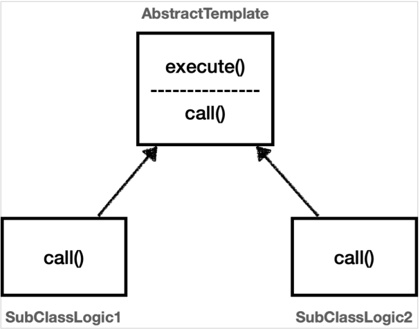

# 템플릿 메서드 패턴과 콜백 패턴

## 템플릿 메서드 패턴 - 시작

### 핵심 기능 vs 부가 기능

핵심 기능은 해당 객체가 제공하는 고유의 기능이다.
예를 들어서 orderService 의 핵심 기능은 주문 로직이다.

메서드 단위로 보면 `orderService.orderItem()`의 핵심 기능은 주문 데이터를 저장하기 위해
리포지토리를 호출하는 `orderRepository.save(itemId)` 코드가 핵심 기능이다.

부가 기능은 핵심 기능을 보조하기 위해 제공되는 기능이다.
예를 들어서 로그 추적 로직, 트랜잭션 기능이 있다.
이러한 부가 기능은 단독으로 사용되지는 않고, 핵심 기능과 함께 사용된다.
예를 들어서 로그 추적 기능은 어떤 핵심 기능이 호출되었는지 로그를 남기기 위해 사용한다.
그러니까 핵심 기능을 보조하기 위해 존재한다

### 변하는 것과 변하지 않는 것을 분리

좋은 설계는 변하는 것과 변하지 않는 것을 분리하는 것이다.
여기서 핵심 기능 부분은 변하고, 로그 추적기를 사용하는 부분은 변하지 않는 부분이다.
이 둘을 분리해서 모듈화해야 한다.

**템플릿 메서드 패턴**(Template Method Pattern)은 이런 문제를 해결하는 디자인 패턴이다.

## 템플릿 메서드 패턴 - 예제 1

### 예제

#### TemplateMethodTest

```java
@Slf4j
public class TemplateMethodTest {

    @Test
    void templateMethodV0() {
        logic1();
        logic2();
    }

    private void logic1() {
        long startTime = System.currentTimeMillis();

        log.info("비즈니스 로직 1 실행");

        long endTime = System.currentTimeMillis();
        long resultTime = endTime - startTime;
        log.info("resultTime = {}", resultTime);
    }

    private void logic2() {
        long startTime = System.currentTimeMillis();

        log.info("비즈니스 로직 2 실행");

        long endTime = System.currentTimeMillis();
        long resultTime = endTime - startTime;
        log.info("resultTime = {}", resultTime);
    }
}
```

#### 실행 결과

```
비즈니스 로직 1 실행
resultTime = 2
비즈니스 로직 2 실행
resultTime = 0
```

### 분석

* 변하는 부분: 비즈니스 로직
* 변하지 않는 부분: 시간 측정

이제 이 둘을 분리해보자.

## 템플릿 메서드 패턴 - 예제 2

### 템플릿 메서드 패턴 구조



### 예제

#### AbstractTemplate

```java
/**
 * 템플릿 메서드 패턴
 * - 추상 클래스 이용
 */
@Slf4j
public abstract class AbstractTemplate {

    /**
     * call() 메서드의 작동 시간을 구하는 메서드
     */
    public void execute() {
        long startTime = System.currentTimeMillis();

        call();

        long endTime = System.currentTimeMillis();
        long resultTime = endTime - startTime;
        log.info("resultTime = {}", resultTime);
    }

    /**
     * 비즈니스 로직 구현
     */
    protected abstract void call();
}
```

#### SubClassLogic1

```java
/**
 * 비즈니스 로직 1
 */
@Slf4j
public class SubClassLogic1 extends AbstractTemplate {
    @Override
    protected void call() {
        log.info("비즈니스 로직 1 실행");
    }
}
```

#### SubClassLogic2

```java
/**
 * 비즈니스 로직 2
 */
@Slf4j
public class SubClassLogic2 extends AbstractTemplate {
    @Override
    protected void call() {
        log.info("비즈니스 로직 2 실행");
    }
}
```

#### TemplateMethodTest

```java
@Slf4j
public class TemplateMethodTest {
    /**
     * 템플릿 메서드 패턴 적용
     */
    @Test
    void templateMethodV1() {
        AbstractTemplate template1 = new SubClassLogic1();
        template1.execute();

        AbstractTemplate template2 = new SubClassLogic1();
        template2.execute();
    }
}
```

#### 결과 로그

```
SubClassLogic1   - 비즈니스 로직 1 실행
AbstractTemplate - resultTime = 4
SubClassLogic1   - 비즈니스 로직 1 실행
AbstractTemplate - resultTime = 0
```

### 템플릿 메서드 패턴 인스턴스 호출 그림


템플릿 메서드 패턴은 이렇게 다형성을 사용해서 변하는 부분과 변하지 않는 부분을 분리하는 방법이다.

## 템플릿 메서드 패턴 - 예제 3

### 익명 내부 클래스 사용하기


### 예제

#### TemplateMethodTest

```java
/**
 * 템플릿 메서드 패턴, 익명 내부 클래스 사용
 */
@Test
void templateMethodV2() {
    AbstractTemplate template1 = new AbstractTemplate() {
        @Override
        protected void call() {
            log.info("비즈니스 로직 1 실행");
        }
    };
    log.info("클래스 이름 1 = {}", template1.getClass());
    template1.execute();

    AbstractTemplate template2 = new AbstractTemplate() {
        @Override
        protected void call() {
            log.info("비즈니스 로직 2 실행");
        }
    };
    log.info("클래스 이름 2 = {}", template2.getClass());
    template2.execute();
}
```

#### 실행 결과

```
TemplateMethodTest - 클래스 이름 1 = class hello.springcoreadvanced1.trace.template.TemplateMethodTest$1
TemplateMethodTest - 비즈니스 로직 1 실행
AbstractTemplate   - resultTime = 0

TemplateMethodTest - 클래스 이름 2 = class hello.springcoreadvanced1.trace.template.TemplateMethodTest$2
TemplateMethodTest - 비즈니스 로직 2 실행
AbstractTemplate   - resultTime = 0
```

## 템플릿 메서드 패턴 - 적용 1

### AbstractTemplate

```java
public abstract class AbstractTemplate<T> {
    private final LogTrace trace;

    public AbstractTemplate(LogTrace trace) {
        this.trace = trace;
    }

    public T execute(String message) {
        TraceStatus status = null;

        try {
            status = trace.begin(message);

            T result = this.call();

            trace.end(status);
            return result;
        } catch (Exception e) {
            trace.exception(status, e);
            throw e;
        }
    }

    protected abstract T call();
}
```

* `AbstractTemplate`은 템플릿 메서드 패턴에서 부모 클래스이고, 템플릿 역할을 한다.
* `<T>` 제네릭을 사용했다. 반환 타입을 정의한다.
* 객체를 생성할 때 내부에서 사용할 `LogTrace trace`를 전달 받는다.
* 로그에 출력할 `message`를 외부에서 파라미터로 전달받는다.
* 템플릿 코드 중간에 `call()` 메서드를 통해서 변하는 부분을 처리한다.
* `abstract T call()`은 변하는 부분을 처리하는 메서드이다. 이 부분은 상속으로 구현해야 한다.

### MVC

#### OrderController V4

```java
@RestController
@RequestMapping("/v4")
@RequiredArgsConstructor
public class OrderControllerV4 {
    private final OrderServiceV4 orderService;
    private final LogTrace trace;

    @GetMapping("/request")
    public String request(
            @RequestParam String itemId
    ) {
        AbstractTemplate<String> abstractTemplate = new AbstractTemplate<>(trace) {
            @Override
            protected String call() {
                orderService.orderItem(itemId);
                return itemId;
            }
        };

        return abstractTemplate.execute("OrderController.request()");
    }
}
```

#### OrderService V4

```java
@Service
@RequiredArgsConstructor
public class OrderServiceV4 {
    private final OrderRepositoryV4 orderRepository;
    private final LogTrace trace;

    public void orderItem(String itemId) {
        AbstractTemplate<Void> abstractTemplate = new AbstractTemplate<>(trace) {
            @Override
            protected Void call() {
                orderRepository.save(itemId);
                return null;
            }
        };

        abstractTemplate.execute("OrderService.orderItem()");
    }
}
```

#### OrderRepository V4

```java
@Slf4j
@Repository
@RequiredArgsConstructor
public class OrderRepositoryV4 {

    private final LogTrace trace;

    public void save(String itemId) {
        AbstractTemplate<Void> abstractTemplate = new AbstractTemplate<>(trace) {
            @Override
            protected Void call() {
                if (itemId.equals("ex")) {
                    throw new IllegalStateException("예외 발생!");
                }
                sleep(1000);

                return null;
            }
        };

        abstractTemplate.execute("OrderRepository.save()");
    }

    private void sleep(int millis) {
        try {
            Thread.sleep(millis);
        } catch (InterruptedException e) {
            log.info("Thread Sleep Interrupted", e);
        }
    }
}
```

### 실행 결과

* http://localhost:8080/v4/request?itemId=hello

```
h.s.trace.logtrace.ThreadLocalLogTrace   : [cb94011b] OrderController.request()
h.s.trace.logtrace.ThreadLocalLogTrace   : [cb94011b] |-->OrderService.orderItem()
h.s.trace.logtrace.ThreadLocalLogTrace   : [cb94011b] |   |-->OrderRepository.save()
h.s.trace.logtrace.ThreadLocalLogTrace   : [cb94011b] |   |<--OrderRepository.save() time = 1004ms
h.s.trace.logtrace.ThreadLocalLogTrace   : [cb94011b] |<--OrderService.orderItem() time = 1004ms
h.s.trace.logtrace.ThreadLocalLogTrace   : [cb94011b] OrderController.request() time = 1006ms
```

## 템플릿 메서드 패턴 - 적용 2

## 템플릿 메서드 패턴 - 정의

## 전략 패턴 - 시작

## 전략 패턴 - 예제 1

## 전략 패턴 - 예제 2

## 전략 패턴 - 예제 3

## 템플릿 콜백 패턴 - 시작

## 템플릿 콜백 패턴 - 예제

## 템플릿 콜백 패턴 - 적용
